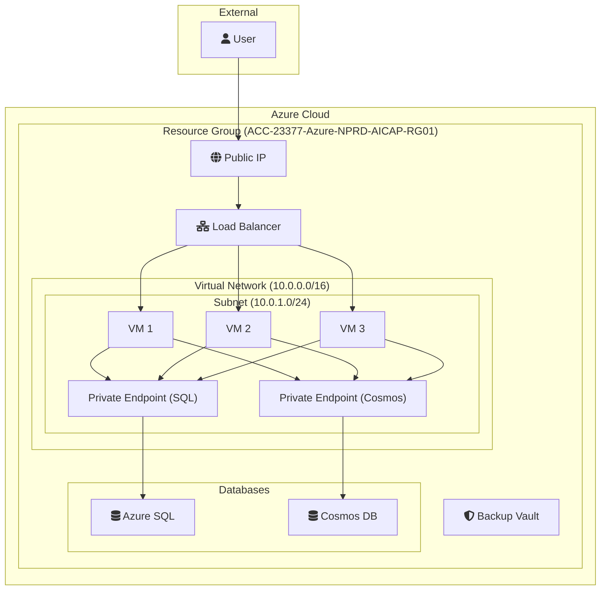

# Azure Infrastructure Deployment with Terraform and Azure DevOps

## Overview

This project deploys a comprehensive application infrastructure on Microsoft Azure using Terraform. The entire process is automated through a CI/CD pipeline in Azure DevOps, which runs on a self-hosted agent.

The architecture is designed with security in mind, utilizing private endpoints to ensure that database access is restricted to the private virtual network.

---

## Architecture Review

The provisioned infrastructure consists of the following components:

### 1. Networking
- **Virtual Network (VNet):** A dedicated VNet (`10.0.0.0/16`) provides an isolated network environment for all resources.
- **Subnet:** A single subnet (`10.0.1.0/24`) hosts the compute resources and private endpoints. Because all VMs and private endpoints reside in the same subnet, all VMs can communicate with all databases securely.
- **Public IP & Load Balancer:** A standard Load Balancer with a static public IP address is used to distribute incoming traffic and provide public access to the application. NAT rules are configured for direct SSH access to the VMs on specific ports.
- **Private Endpoints:** To enhance security, Private Endpoints are created for both the Azure SQL and Cosmos DB databases. This ensures that the databases are not exposed to the public internet and can only be accessed from within the virtual network.
- **Private DNS Zones:** Private DNS zones (`privatelink.database.windows.net` and `privatelink.documents.azure.com`) are configured to resolve the database hostnames to their private IP addresses within the VNet.

### 2. Compute
- **Virtual Machines:** The application is hosted on three Linux Virtual Machines (`Standard_B2pts_v2`). These VMs are placed behind the load balancer to ensure high availability.

### 3. Databases
- **Azure SQL Server:** A managed SQL server for relational data.
- **Azure Cosmos DB:** A globally distributed, multi-model database for NoSQL data.

### 4. Security
- **Network Security Group (NSG):** An NSG is associated with the subnet to control inbound and outbound traffic, acting as a firewall.

### 5. Backup
- **Azure Backup Vault:** A Recovery Services Vault is provisioned to manage backups for the virtual machines, protecting against data loss.

### 6. CI/CD & State Management
- **Azure DevOps Pipeline:** The entire infrastructure is deployed and managed via a YAML pipeline in Azure DevOps.
- **Self-Hosted Agent:** The pipeline runs on a self-hosted agent, providing flexibility and control over the execution environment.
- **Remote State:** Terraform's state is stored securely in an Azure Storage Account, which is created as a prerequisite. This allows for team collaboration and reliable state management.

---

## Architecture Diagram

---

## How to Deploy

1.  **Prerequisites:**
    - Create an Azure Storage Account and a container to be used for the Terraform remote state backend.
    - Create an Azure DevOps project.

2.  **Configuration:**
    - Create an ARM Service Connection in Azure DevOps with the `Contributor` role on the target subscription.
    - Create a Variable Group containing the Service Principal credentials (`ARM_CLIENT_ID`, `ARM_CLIENT_SECRET`, `ARM_TENANT_ID`, `ARM_SUBSCRIPTION_ID`) and the `admin_password` for the VMs.
    - Set up a self-hosted agent with Terraform, Azure CLI, and PowerShell Core installed.

3.  **Execution:**
    - Update the `azure-pipelines.yml` file to point to the correct variable group name and agent pool name.
    - Push the code to the GitHub repository to trigger the pipeline.
    - Authorize the pipeline's use of the service connection and variable group on the first run.